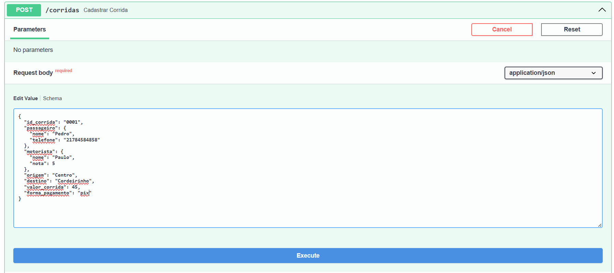
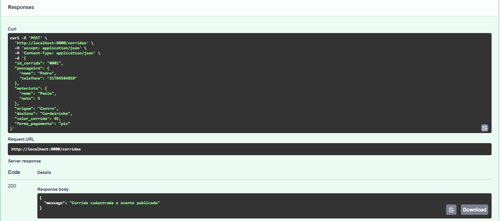
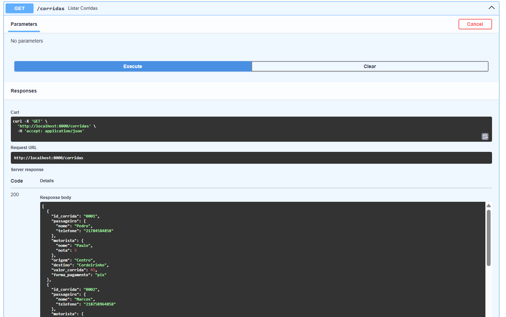
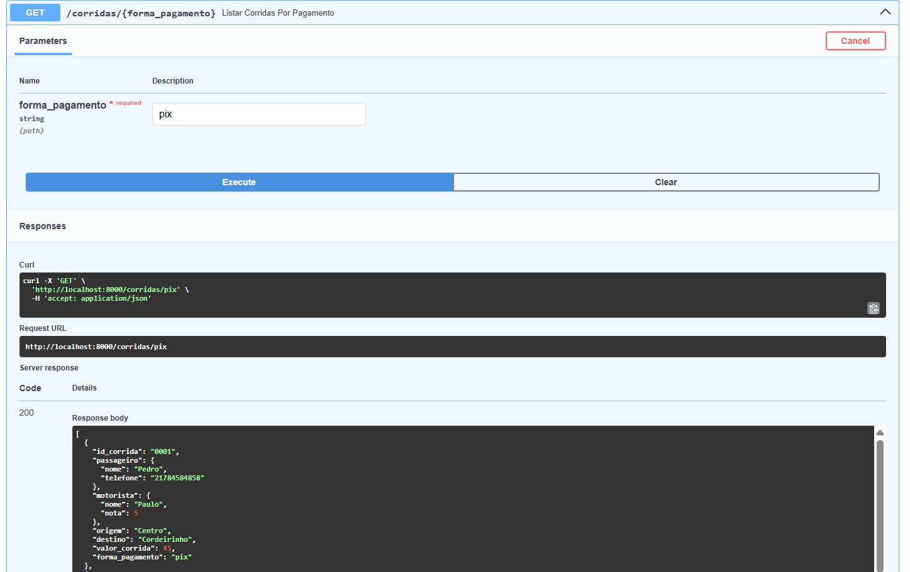
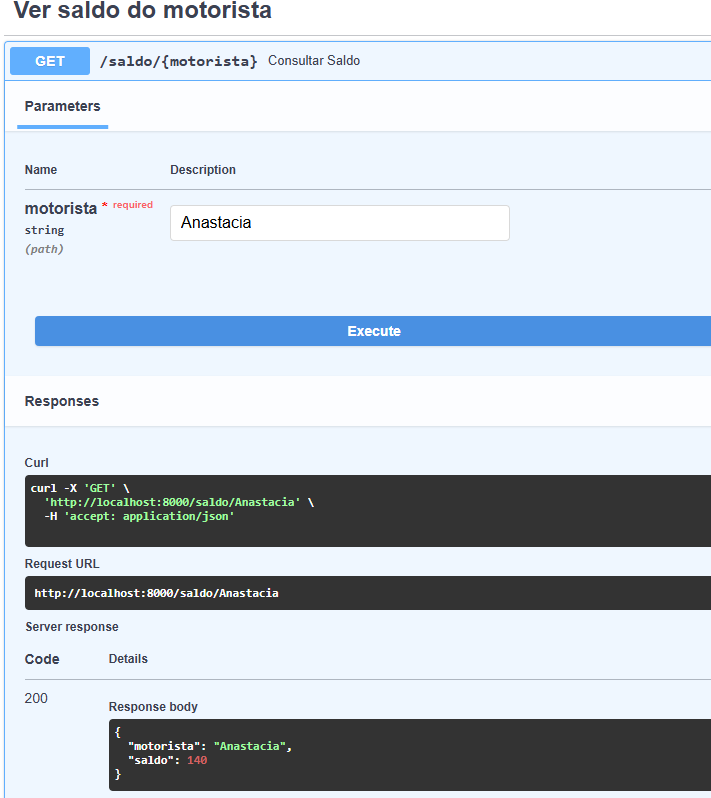
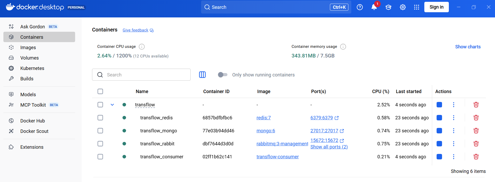
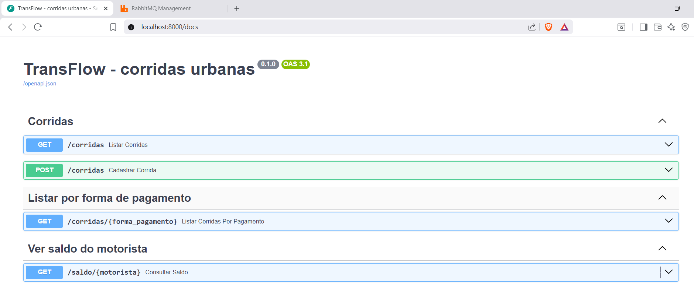
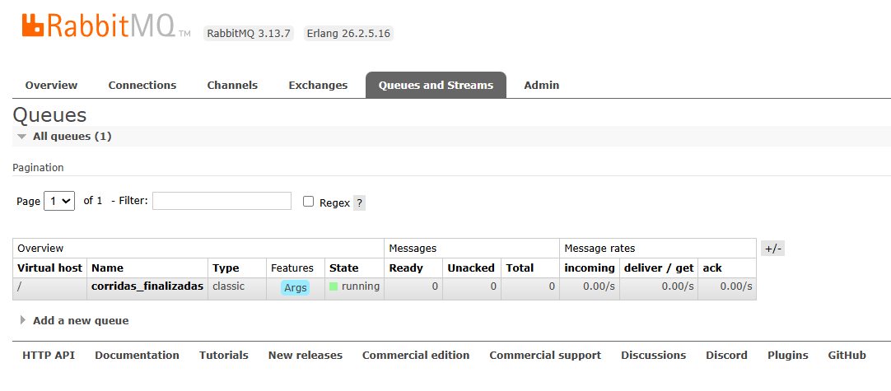
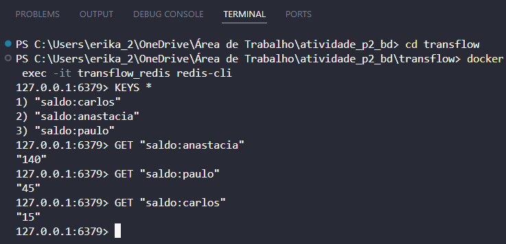

# TransFlow – Sistema de Corridas com FastAPI, MongoDB, Redis e RabbitMQ

Este projeto implementa um protótipo de backend para gerenciamento de corridas urbanas utilizando:

- FastAPI
- MongoDB (persistência de corridas)
- Redis (saldo dos motoristas)
- RabbitMQ + FastStream (processamento assíncrono de eventos)

O objetivo é simular o fluxo completo de uma corrida sendo cadastrada, enviada como evento e processada de forma assíncrona.

## Como rodar o projeto

### 1 - Pré-requisitos: ter o Docker instalado
https://www.docker.com/products/docker-desktop/

### 2 - Abrir o Docker Desktop

### 3 - Subir os containers
dentro da pasta transflow rode:
```bash 
docker-compose up --build 
```

e aguarde até que esses serviços estejam rodando:

- transflow_app
- transflow_consumer
- transflow_rabbit
- transflow_mongo
- transflow_redis

## Principais Endpoints
Acesse o Swagger:
http://localhost:8000/docs

### 1. Cadastrar corrida

POST /corridas

Exemplo:



Ao cadastrar, o sistema:

1. Salva a corrida no MongoDB
2. Publica o evento no RabbitMQ
3. O consumer recebe o evento
4. Atualiza o saldo do motorista no Redis

### 2. Listar corridas

GET /corridas

Retorna todas as corridas salvas no MongoDB.
Exemplo:


### 3. Filtrar por forma de pagamento

GET /corridas/{forma_pagamento}

Exemplo:


### 4. Ver saldo do motorista

GET /saldo/{motorista}

Exemplo:


## Screenshots do sistema

### Containers rodando


### Swagger


### RabbitMQ


### Visualização de saldo no Redis

